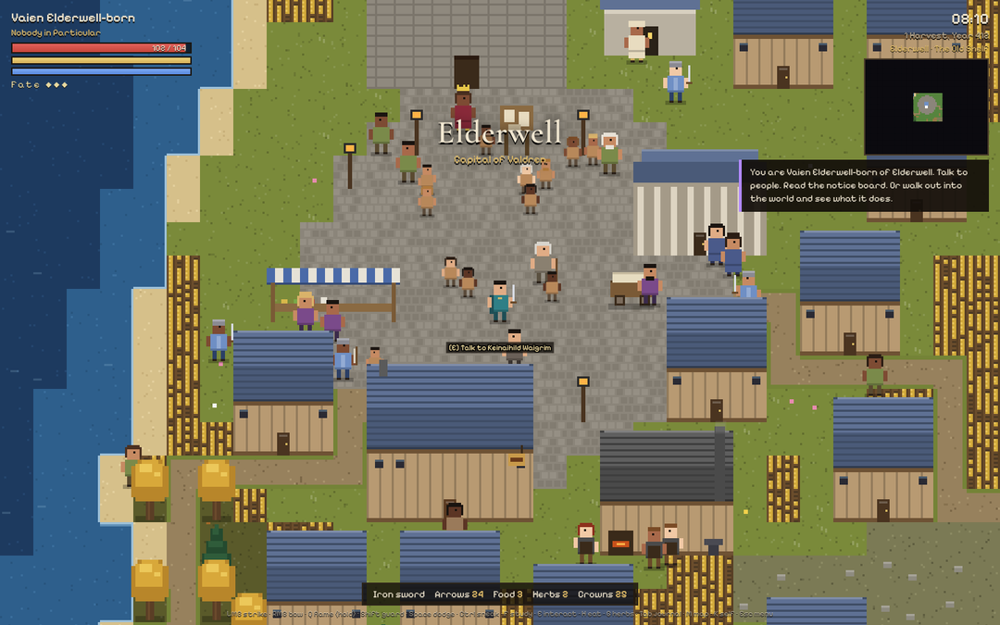
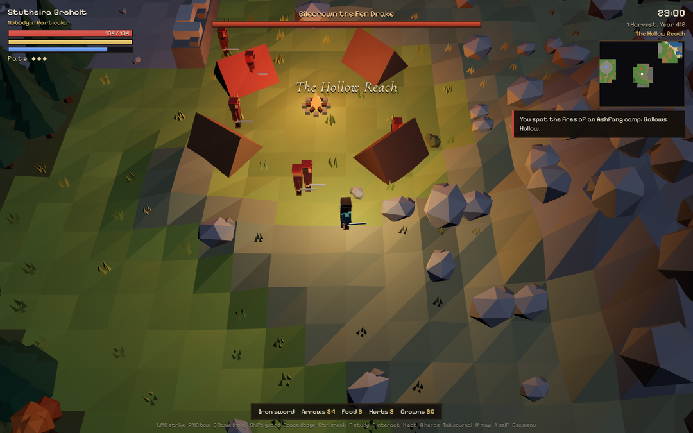
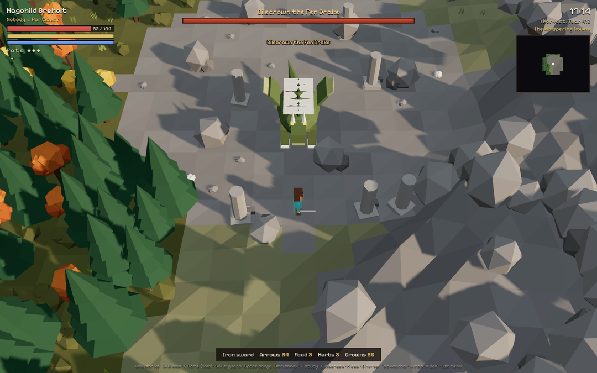
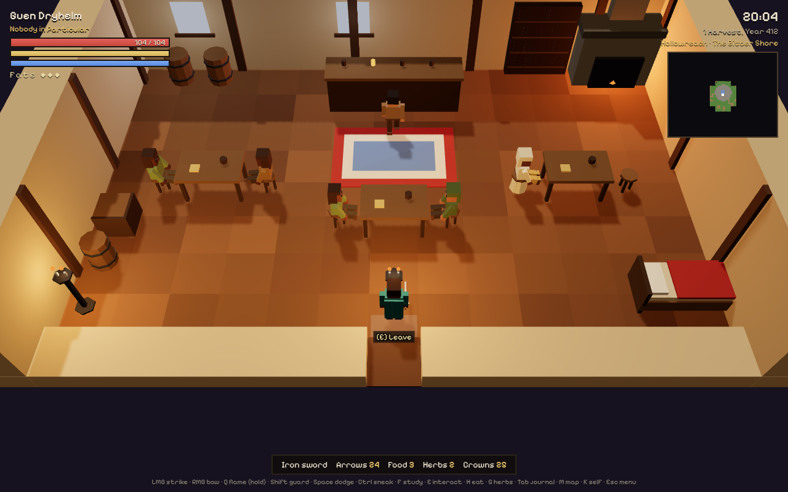
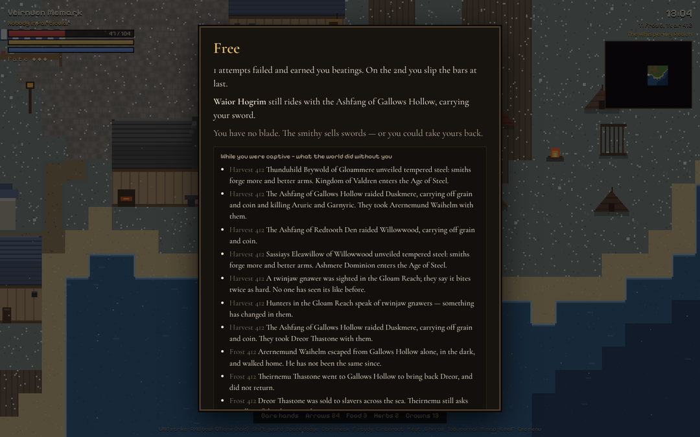
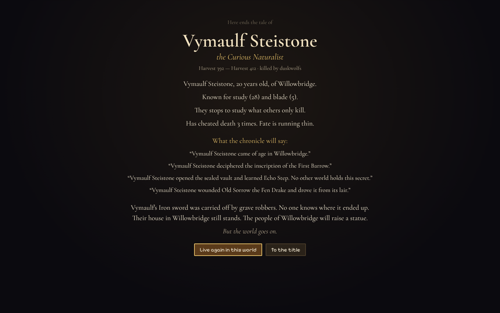
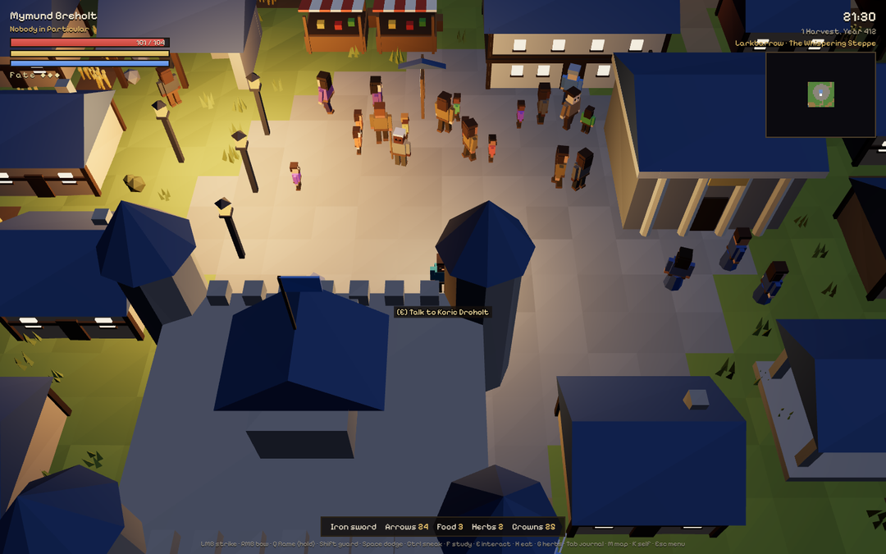
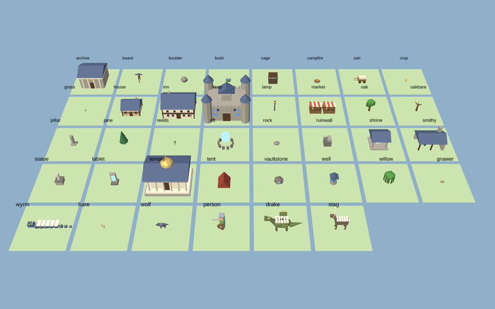

# ECHO — The Living Realm

> *A world that existed before you, continues without you, remembers what you do, and may never become the same world twice.*

ECHO is a desktop RPG built around one idea: **consequence**. You begin as an ordinary person in a world that is already alive — kingdoms, a religious order, outlaws, monsters, an economy and an ecosystem — and none of it waits for you.



**Now in 3D.** Every building, tree, person, beast and boss is a low-poly model built in Blender (`blender/build_assets.py`), drawn with Three.js under a moving sun with real shadows, fog, lanterns and campfires that light the dark, windows that glow at night, crops that thin when vermin eat the fields, and snow in winter. Machines without 3D support fall back to the classic pixel-art view automatically (also switchable in the Esc menu).



## What's in this build

Every system below is real and connected to the others. Nothing is scripted.

**A living world.** Every inhabitant is a persistent person with a name, family, traits, memories and opinions. They work, eat, feud, marry, have children, change trades, migrate when hungry, turn outlaw when desperate, rise through the ranks, and die — whether or not you're watching. Kingdoms collect taxes, pay soldiers, suffer riots, crown usurpers, declare war over hunger, and conquer each other's towns.

**People with purpose.** Everyone has a goal that grows out of who they are and what is happening to them — saving for a stall, courting a neighbour, becoming a master smith, making sergeant, a pilgrimage, the reeve's chair, fleeing the monster in the hills, or avenging a murdered parent. Goals advance every day and succeed or fail, changing lives. Each person also perceives their own world — how safe it is and from what, whether there is bread, what they think of their ruler, and what the rumours have told them about you — and acts on it: the frightened come home before dark and run for a door when wolves appear, the bereaved attack their parent's killer on sight, the grateful bring gifts, friends cover for your crimes, and shopkeepers charge what your name is worth. Ask anyone *What do you want most?* and help if you like; the journal's *People* page tracks everyone who has feelings about you.

**Music that is never the same twice.** The score is composed live: each place and moment — the wild by day and by night, towns, inns, temples, fights, bosses, festivals and the uncanny — has its own key, mode, tempo and instruments, and short pieces are written on the spot from a motif and its answer, then left to silence. Birds sing by day, crickets by night, wind rises in winter and on the hills, water murmurs by rivers, and discoveries are marked by stingers.

**Wonders.** Twelve Echoes of the old world lie far from any town; on clear nights wisps gather and lead the patient to them, and each shows a vision of the people who spoke the world's dead tongue — teaching words of it, adding life, and every fourth restoring a thread of fate. Stars streak across clear skies and some fall to earth, leaving star-iron that a smith can forge into your blade, a priest can give to the flame, or a merchant will pay well for. The restless dead linger by their homes at night with last words for someone; carry them home. A white hind walks the forest's edge at dawn and dusk — approach quietly for her blessing, or kill her and carry her curse. Fireflies fill warm nights.

**Festivals.** Four times a year — the Kindling Fair, Lantern Night, the Harvest Feast and Longnight — every town that can afford it gathers in the square: a bonfire, strings of lanterns, a ring dance, wishing lanterns rising into the dark, the feast (where the old ones tell where the echoes are), an archery contest, and Longnight's vigil until dawn. Starving or plague-struck towns go without, and remember it. Couples are betrothed at the dance.

**Reasons to come back.** People who know you write letters — weddings, children named after you, deaths, threats, pleas — which wait at the next town you enter. Each real day brings an omen: the hind seen in a certain wood, a night of falling stars, restless wisps, a star-merchant in some market. And the world lives on while you're away: a day for every two hours, up to five, with a digest of what happened when you return (this can be switched off in the pause menu).

**Townsfolk who know where they are.** People only walk to places they can actually stand: a goal inside a wall, a tree or a pond is moved to open ground, a blocked straight line becomes a planned route, routes through woods step around trunks, and a place with no way in makes them think again rather than walk into the wall. They step aside for people in their way, face whoever they came to talk to, and react to their own state and the sky — the sick keep to their beds (with a morning trip to the healers), the wounded go to be tended, storms empty the streets, rain sends idlers under a roof, bitter winters send people home early, and the hungry go looking for bread.

**Law and courts.** Each realm keeps its own law — the King's Peace hangs murderers, the Merchant Charter takes a blood-price, the Lantern Rule banishes — and each town bends it: harsh or merciful reeves, judges who can be bought, curfews, temple towns that forbid fire within their walls. Crimes are recorded with the names of the witnesses. Guards try to arrest you before they fight (come quietly, pay on the spot, or resist); at trial you plead, friends speak for you, and the sentence may be a fine, the stocks, the cells, banishment or the gallows. Townsfolk are tried too — thieves fined, feuding killers hanged.

**Weather and disease.** Every region has its own skies with memory: dry spells become droughts that wither the crops, wet seasons flood the river towns, bitter winters cost bread and take the old. Plagues are born in hungry, crowded or flooded towns, spread house to house and ride the roads with caravans, pilgrims and armies; healers and herbs blunt them, wise reeves shut the gates, and you can catch them too.

**Property, work and money.** Houses, fields and workplaces belong to someone. Owners pay wages and collect rent; the poor borrow and can lose their homes; when someone dies their house, savings, business and debts pass to their heirs — sometimes with a family quarrel. You can buy or rent a house, buy fields worked by tenants, buy shares in a mill, mine, smithy or inn, and lend money (and take defaulters before the reeve).

**Production chains.** Towns have mills, mines and lumber camps worked by named people. Grain becomes flour at the mill, the smith needs ore and charcoal, and the labour market moves people to the plough when bread is dear. Kill the miners and the ore stops; burn the mill and bread climbs until the reeve finds timber and coin to rebuild.

**Lives on the road.** Pilgrims, migrants fleeing hunger or fear, fortune-seekers, caravans and marching armies are real people you meet mid-journey; they tell you where they're going and why, and bring the news of the town they left. Ask anyone about the people in their life and they'll tell you what each of them is doing — or how they died.

**Pace of life.** Choose Brisk, Steady or Lifelike when you create a world (or later in the menu): a day lasts 6, 12 or 24 real minutes.

**Consequences that chain.** Each region has a food web. The great apex beasts keep the crop-eating vermin down. Kill one and, over the following weeks, the vermin multiply, the fields are stripped (you can see the crops thin), bread prices climb, people go hungry, migrate, riot, turn to banditry, and hungry kingdoms grow warlike. The game never tells you it was your fault.

**World intelligence.** Factions remember *how* they are being killed. Shoot the Ashfang and they start carrying shields; burn them and they ward against fire; strike at night and they post watches; kill their chiefs and chiefs keep bodyguards. Beasts evolve over generations under the same pressure (ashen wolves that won't burn, ironhide hides that turn blades), and rare mutations appear that may exist in no other world.

**Bosses that learn.** Apex monsters watch which way you dodge and strike where you're going. Turtle behind your guard and they break it. Snipe from cover and they smash the cover. Beaten, they flee — and come back armored against whatever hurt them most, and they remember you.



**Combat with weight.** Strikes chain into a three-hit combo that ends in a spinning finisher; hold the button for a heavy, guard-breaking blow that staggers whatever it hits. Every hit lands with a beat of hit-stop, sparks, a camera kick and synthesized sound; kills throw bodies back; a perfect guard rings like a bell and slows time for a moment. Foes flash before they strike so you can read them. A dodge-roll and buffered inputs keep it responsive, and loosing an arrow just as the bow reaches full draw makes a perfect shot.

**Techniques found in battle.** Fight a lot and your body discovers how it likes to fight. Fifteen techniques each wait behind a habit: enough perfect guards and you find the *riposte*; enough rolls under a blade and you *lunge* out of them; enough finishers and the spin becomes a *whirlwind*; enough fire and your blade catches it (*ember edge*); enough kills and you learn the *war cry*. Others come from blocking, staggering foes, unbroken combos, close calls, taking punishment, slipping hits, arrows, perfect shots, flame and stealth. Each grows through three ranks with use. You can carry two at first and up to five as you learn more, so the build is yours to choose on the character page.

**Places in the wild.** Every world scatters landmarks across its land — standing stones that teach the old tongue, lookouts that fill in the map and reveal what lies around them, moonwells that heal at night, a great oak to rest under, old battlefields to search, wayside shrines and wrecks — and *delves* to clear: barrows and crypts of the restless dead, wolf dens, and outlaw hideouts, each a room below ground with a master by its chest. Cleared delves fill again in time. Towns post quests to match: something stirring in a barrow, a child lost in the woods (find them and lead them home), a great named wolf to hunt, a treasure map, a parcel for someone in another town. The archives buy accounts of what you find.

**Rulers with aims.** Each ruler pursues an agenda shaped by their character and their realm's state — expansion, building, conquest, trade, faith or security — and re-chooses it as things change. Kingdoms commission walls, granaries, houses, roads, watchtowers and statues (and pay for supplies); issue decrees such as bounties, conscription, tax changes, alms, curfews and fire bans; sign trade pacts, arrange royal marriages and fight joint campaigns; and send surveyors to the frontier to found new villages. Clear the land before the settlers set out and you name the village and become its warden, with a share of its dues each season. Courts breed plots — expose them, join them, or blackmail the plotter — and a plot left alone may end in a coup. The Lantern brokers peace in long wars and defends its faithful.

**A purpose: six ambitions.** At the start of a life you choose what it is for: **the Blade** (Sellsword → Champion → Knight → Beastbane → Legend), **the Crown** (Householder → Warden → Steward → Lord → High Lord), **the Purse** (Peddler → Shareholder → Landlord → Merchant Prince → Banker of the Realm), **the Lore** (Seeker → Lorekeeper → Echo-walker → Vault-opener → Keeper of the Old Tongue), **the Road** (Wanderer → Pathfinder → Cartographer → Trailblazer → Worldwalker) or **the Watch** (Deputy → Constable → Sergeant → Captain → Lord Marshal). Every standing asks for concrete deeds in the world, is marked with a ceremony, changes the title people know you by, and brings a reward — more life, a carried technique, better prices, cheaper coaches, a stipend from the crown, a statue. You rise on every road you walk, not only the one you chose. A line at the top of the screen always shows the next step on your road, with an arrow, the distance and, when it is near, a beacon of light over the place; any quest in your journal can be tracked instead.

**A village of your own.** Buy a royal charter at a capital's keep (renown 20, 250 crowns). Clear the land the crown grants you, return to name your village, and the settlers follow. From then on you are its warden. Fund works (houses, fields, a granary, a palisade, a watchtower, a market fair, your own statue), set the dues (low to let it grow, high to grow rich and make it angry), and send criers to draw settlers. It grows, or starves, with the rest of the living world.

**Work and travel.** Take a three-hour shift at a mill, mine, lumber camp, smithy or inn for wages that follow the town's prosperity. It trains your skills and earns you goodwill. Coaches run along the roads between towns: pay the fare and the hours pass while the world goes on, though outlaws on dangerous roads sometimes stop the coach.

**Vast worlds.** New worlds are *vast* by default: 320×240 tiles (2.5 times the area) with about fifteen towns, 48 regions, highlands and peaks, more rivers, lairs, ruins and outlaw camps, a denser road network, and twice the landmarks, delves, wonders, caches and herbs. Neighbouring towns send grain to each other in hard times. Standard-size worlds and existing saves still work.

**Dungeons, monsters and loot.** Below the world lie dungeons spread across the whole map: catacombs, goblin warrens, spider nests, troll dens, drowned sanctums and deep forges, alongside the older barrows, crypts, dens and hideouts. The further from the capitals, the deadlier they are (★ to ★★★★★★). Each has several floors joined by stairs, a cache on every floor and a lord waiting on the last: the Necromancer, the Goblin Warlord, the Spider Queen, the Ogre Chieftain, the Forge Golem. There are eighteen kinds of monster, each with its own strength and abilities: skeletons that shrug off arrows, ghouls with rotting claws, goblins that hunt in packs, shamans that throw fire and heal, giant rats, spiders that poison and spit webs, slimes that split when cut, trolls that regenerate unless burned, wraiths that teleport and drain your life, cultists casting purple fire, stonelings that bounce arrows, and bosses that summon, slam and charge. Monsters carry levels; some are elites (Hulking, Frenzied, Venomous, Ancient). Every kind you kill goes into your bestiary along with its weakness. Monsters drop coins, parts and gear: bone dust, spider silk, venom, troll hide, ectoplasm, golem cores, grave-iron, heartstones and more. The gear comes in five rarities, and the best pieces carry powers of their own (ember, venom, thirst, keen; warding, thorns, vigor). Sell parts and spare gear at any market. Or take them to a smith, who will hone your blade, restring your bow and reinforce your armour, five steps each, and make armour from hides, silk, troll hide, grave-iron and golem cores.

**Growing stronger, and knowing your enemy.** Every foe you defeat gives experience. The stronger it is than you, the more you get; things far beneath you teach you almost nothing. Experience raises your level (1–15) and your rank: Novice, Fighter, Veteran, Champion, Hero, Legend, Mythic. Each level adds 7% to every blow you strike, with sword, bow and fire, plus life and stamina; each new rank gets its own ceremony. Your level, rank and experience bar sit under your name, and your cape takes your rank's colour. Every foe shows its level and rank. Wolves, outlaws and great beasts are measured too, not only dungeon monsters. The label is coloured by how the foe compares to you: grey trivial, green easy, white even, gold hard, orange deadly ☠☠, red run ☠☠☠. ◆ marks an elite, ◆◆ a champion, ♛ a lord. A panel in the corner shows the foe you face: its level, rank, health, how far above or below you it stands, what it's worth, and its weakness once it is in your bestiary. Dungeon lords get the great health bar across the top. Upgrades show on your body: honed blades grow longer and brighter, with a jewel set for each step and a glow and sparks for the finest. Armour changes your clothes and, as it is reinforced, adds a helm, shoulder plates and a crest. Your character page draws you in your gear, with a picture of each piece. The smith shows each piece before and after an upgrade.

**The map (M).** A parchment chart of the land you have walked, with relief shading, shorelines, roads and region names, and unexplored land hidden under the parchment. Scroll to zoom, drag to move. Every place has its own icon. Dungeons are dark badges with a stairway mouth, ringed in the colour of their danger to you; a dashed ring with a "?" marks one glimpsed from afar, and a tick marks one you have cleared. Towns are houses in their realm's colour, with a crown on capitals. The other icons cover outlaw camps, the lairs of great beasts, landmarks, wonders and ruins. Hover over a place for its details; click it for a card with **Guide me there**, which sets the line at the top of the screen and a dashed route on the map. Click empty ground to mark your own waypoint. A side panel lets you switch layers on and off and lists every dungeon you know, with danger, floors cleared and distance. The minimap shows dungeons, towns, camps and lairs, an arrow for the way you face, and a pointer at its edge toward wherever you are headed. Known dungeon entrances float their name and stars over the land as you approach.

**The guide (J).** One page tells you what to do next and how to do it. It shows your current objective broken into steps with plain instructions, practical suggestions (you're hurt, you have no armour, the parts you carry are worth this much, this piece in your pack beats what you're using, here is a dungeon that matches your strength, with a button to point you there), every dungeon you know with its danger, floors and progress, the bestiary, and a short explanation of fighting, dungeons, loot, money and finding your way. The line at the top of the screen can now point you to any dungeon. The Blade road asks for dungeons too: clearing one, filling the bestiary, reaching the bottom of a deep dungeon, slaying dungeon lords.

**A watch in every town.** Policing is part of the government's daily work. Each town keeps a watch — a captain and watchmen paid from the realm's treasury — who walk real rounds: one keeps the gate by day, the rest walk between the square, market, inn, keep and lanes, and the night shift carries lanterns. Townsfolk commit crimes for reasons of their own: hunger, greed, grudges, drink, or a thieves' ring that grows in badly policed towns and buys watchmen. Every crime opens a case with witnesses and clues. The watch works each case day by day and solves some. Others go cold, and a corrupt or pressured watch may hang an innocent. Each town has a measured *safety* and *trust in the watch*, which feed fear, unrest and people's decisions. Rulers respond by hiring watchmen, decreeing night watches and curfews, building watchtowers and sacking captains. On the street, cutpurses work the market, drunks brawl outside the inn and burglars try doors at night; the watch gives chase, and so can you.

**Every action has consequences.** If someone sees you commit a crime, they run for the watch. Nothing is known until they arrive, so you can bribe or threaten a witness — or make things worse. A crime nobody saw is still found. The watch asks who was seen near the place, and in time a watchman may stop you with questions. You can tell the truth, lie (a test of your tongue), name a friend who will swear for you (and pays if it comes out), bribe him, or confess. If your crime goes unsolved, someone else may hang for it, and the town will hear the truth if you are named later. You can also serve the watch:
- catch thieves and break up brawls;
- take a case from the board, search the scene, question witnesses, and name the culprit from three suspects (name the wrong one and an innocent is punished on your word);
- uncover who runs a thieves' ring;
- join as a deputy for paid rounds and cases (break the law and you're out).

**Uncharted places.** Each world hides a waterfall, hot springs, a crystal grotto, a giant's bones, a star crater and a fairy ring that no one has named. The first to find one names it for good, and the chronicle remembers who did. Twenty caches lie under cairns, in hollow trees and under loose stones. The first one you search holds a page from a lost expedition's journal. Each page says roughly where the next was left, and the last one leads to the expedition's final camp and its survey. Six rare herbs grow on particular ground: some open only at night, others only by day. They fill your herbarium and herbalists pay well for them. Walking the land is noticed too, and the archive buys your accounts, maps, crystals and the lost survey.

**Walk inside.** Houses, inns, smithies, archives, shrines, temples and keeps can be entered. Each room is laid out and furnished (Blender-built beds, tables, hearths, shelves, thrones), and holds the people who would really be there at that hour: the innkeeper behind the bar and patrons at the tables in the evening, a family asleep at night, the ruler on the throne with guards at the pillars. Rent a bed, kneel at the shrine, read the archive, petition the throne — or slip into a stranger's house at night and search the cupboard, if no one wakes.



**No classes.** You become what you repeatedly do. Eight skills grow by use, and your *tendencies* change how your body fights: aggression quickens your strikes but thins your guard; patience makes guarding cheap; reckless overcasting makes fire mighty and unstable. Your title is a biography of how you played.

**Death makes stories.** Beasts leave you to be found by a named villager, and each fall wears your fate thinner. People take you captive, take your sword, and rise in status for it — you might meet them later as a chieftain carrying your blade. Escape, pay a ransom, or wait for rescue, and come back to a world that moved on without you.



**Pleas that don't wait.** "Please save my son" has a deadline. Ignore it and someone else may try — and succeed, or die. The captive may escape alone and come home changed, or join the outlaws, or be sold across the sea.

**Legacy.** When fate runs out your character dies for good and enters history. Their house stands, their sword ends up somewhere in the world (perhaps with the one who killed them), statues may rise, children are named after them, and you continue as someone new in the same world — perhaps as their kin, inheriting their house and their reputation.



**Civilization advances.** Kingdoms research their way out of the iron age along a mechanical or arcane path, depending on their people and on how much fire magic is thrown around in their lands. Every invention is credited to a named inventor and changes the world — crossbows, clockwork mills, lit streets at night, faster caravans — until one day the air splits open: **the Rift**, through which you can see the histories of your other worlds.

**Mysteries.** Each world generates its own dead language. Ruins hold tablets you decipher word by word; one of them leads to a sealed vault whose secret differs from world to world.

**News travels.** Rumours spread from town to town at the speed of travellers. You only know what you witnessed or heard; your deeds change how people regard you only once the story reaches them. The archives in each capital keep the full chronicle.



## Play

**Play in the browser:** `npm run build:web` produces one self-contained page at `dist/web/index.html`.

**Download:** grab the latest installer from [Releases](https://github.com/MB-125/ECHO/releases), or the newest build from the [Actions](https://github.com/MB-125/ECHO/actions) tab (open a run → *Artifacts*).

| Platform | File |
|---|---|
| Windows | `ECHO Setup x.y.z.exe` (installer) or `ECHO x.y.z.exe` (portable) |
| macOS | `ECHO-x.y.z.dmg` / `ECHO-x.y.z-arm64.dmg` — unsigned: right-click → *Open* the first time |
| Linux | `ECHO-x.y.z.AppImage` (chmod +x) or `.deb` |

**From source** (Node 18+):

```bash
git clone https://github.com/MB-125/ECHO.git
cd ECHO
npm install
npm start
```

### Controls

A see-through controls card sits on the left of the screen while you play (it dims during fights); **F1** hides or shows it.

| | |
|---|---|
| **WASD** | move |
| **Left mouse** | strike (click in rhythm for a 3-hit combo; hold and release for a heavy blow) |
| **Right mouse** (hold) | draw and loose the bow |
| **Q** (hold) | flame — hold longer for a bigger blast; holding past full *overcharges* it, which is stronger but can turn on you or cost blood when mana runs dry |
| **Shift** | guard (tap just as a blow lands for a perfect guard) |
| **Space** | dodge |
| **R** / middle mouse | lock onto a target — you always face and aim at it; press again to release (switches to the next foe when it falls) |
| **Ctrl** | sneak — also required to strike someone who isn't your enemy |
| **F** (hold) | study a creature or boss |
| **E** | talk / interact / enter and leave buildings |
| **H / G** | eat / use herbs |
| **Tab** · **M** · **K** | journal (promises, places, the realm…) · map (zoom, drag, click a place to be guided there) · character (choose which techniques to carry) |
| **J** | the guide — what to do next and how, your dungeons, the bestiary |
| **Esc** | menu · **F11** fullscreen |

Worlds are saved automatically (each in-game day and every few minutes) to your user data folder, one file per world. They never reset.

## Build installers yourself

```bash
npm run dist:win     # Windows
npm run dist:mac     # macOS
npm run dist:linux   # Linux
```

Pushing a tag such as `v0.1.0` makes GitHub Actions build all three platforms and publish a Release automatically.

## Tests

```bash
npm test
```

Runs the world simulation headless: generation, save/load, a year of history, five-year stability, faction adaptation, species evolution, decipherment — and the monster-kill cascade, comparing two identical worlds where only one loses its apex beast.

## How it's built

Plain JavaScript in an Electron shell, rendered with Three.js — no game engine. The 3D models are generated from code in Blender:

```bash
pip install bpy                      # Blender as a Python module (Python 3.11)
python blender/build_assets.py       # builds assets/models/*.glb
node tools/pack-models.js            # packs them into src/js/render/models-data.js
```



```
main.js, preload.js        Electron window + save files
src/js/core.js             seeded RNG, noise, names, calendar
src/js/world/worldgen.js   terrain, rivers, towns, roads, lairs, ruins
src/js/sim/                the living world (runs with or without the player)
  people.js                lives: aging, family, feuds, trades, crime, migration
  ecology.js               food web, crop damage, evolution, mutations
  economy.js               production, prices, caravans, famine aid
  politics.js              camps, raids, unrest, succession, war, conquest
  intel.js                 faction memory of the player's tactics → doctrines
  plights.js               requests with deadlines, resolved without you
  chronicle.js             history, rumour spread, reputation waves
  civ.js                   eras, inventions, the Rift
  mysteries.js             procedural language, tablets, the vault
  legacy.js                skills, Becoming, permanent death, legends
src/js/game/               real-time layer: player, AI, bosses, combat, capture
src/js/render/renderer3d.js 3D world: terrain, instanced props, animation, lighting
src/js/render/models.js     loads and prepares the Blender models
src/js/render/renderer2d.js classic pixel-art renderer (fallback)
blender/build_assets.py     every 3D model, built from code in Blender
src/js/ui/                 HUD, dialogue, trade, archive, screens
tests/run-tests.js         headless simulation tests
```

## Scope today, and where it can grow

This is a first playable slice of a very large idea. A world here holds a few hundred named people across a handful of towns rather than millions, and other worlds are your own local saves (seen through the Rift) rather than other players' servers. The architecture — a deterministic simulation that runs headless and a thin real-time layer that gives it bodies — is built to grow: bigger maps, more factions and species, multiplayer worlds, and dimensional travel between them.

Fonts: Pixelify Sans and Cormorant Garamond, SIL Open Font License 1.1.
